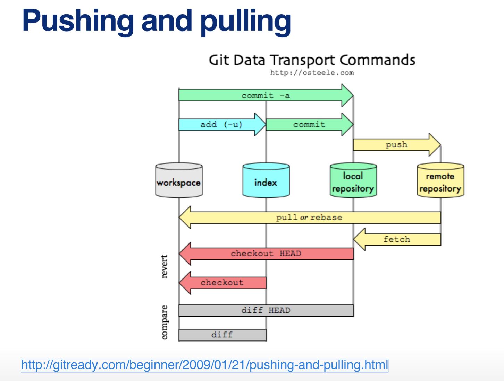
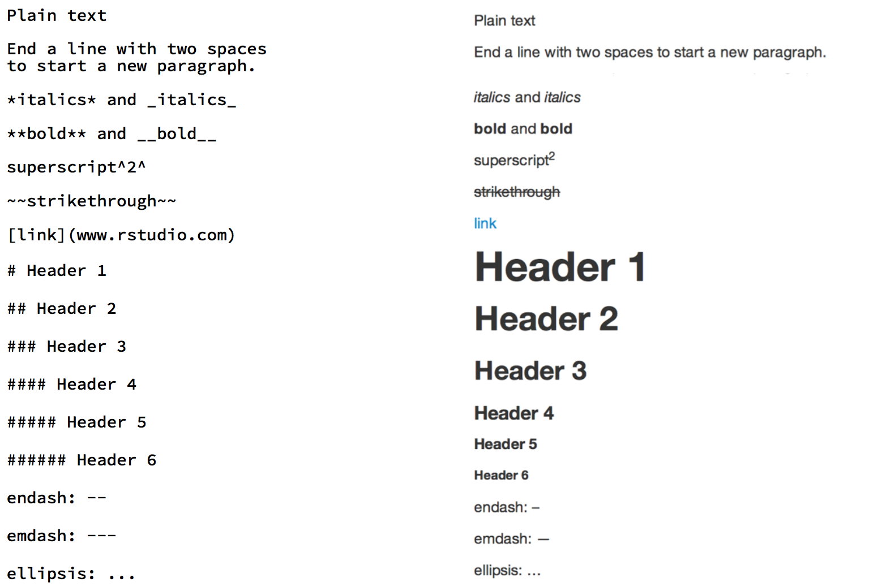
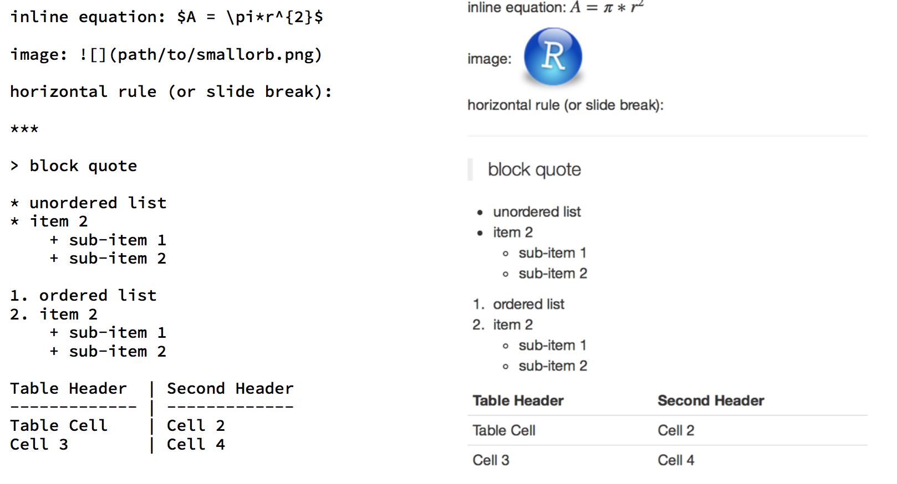
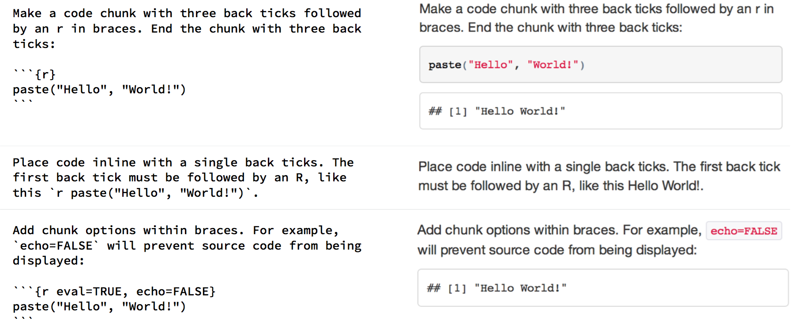

## What is Git?
Git is a free and open source distributed version control system designed to handle everything from small to very large projects with speed and efficiency.
[https://git-scm.com/]  
* Most popular implementation of version control  
* Everything is stored in local repositories on your computer  
* Operated from the command line  
Download at [https://git-scm.com/downloads]  

## Opening Git
* On Mac: go to Terminal and type 
```{r, eval=FALSE}
git --version
```
* Set you username: 
```{r,eval=FALSE} 
$ git config --global user.name "Your Name"
```
* Set your email: 
```{r,eval=FALSE} 
$ git config --global user.email "your_name@domain.com"
```
## Opening Git
* On PC: go to GitBash and open it, then set username and email (same as for Mac)
* To confirm the changes, type
```{r,eval=FALSE} 
  $ git config --list
```
* Exit Git:
```{r,eval=FALSE} 
  $ exit
```


## What is GitHub?

GitHub is a web-based Git repository hosting service. It offers all of the distributed version control and source code management (SCM) functionality of Git as well as adding its own features.
[https://en.wikipedia.org/wiki/GitHub] 

## Set up GitHub Account

- Go to  (https://github.com/)
- Enter username, email (same as for Git) & password to sign up
- Download GitHub Desktop: [https://desktop.github.com/]

## Git and GitHub
* You don't need GitHub to use Git
* Git=Local; GitHub=Remote
* GitHub allows to:
  + Share your repositories with others
  + Access other user's repositories
  + Store remote copies of your repositories on GitHub server

## GitHub allows you to:
(1) sync (the button in the app, which does pull and then push)
(2) do your work making edits on your computer as you would normally
(3) when done with a chunk of work or for the day,
    (a) press sync, wait until it completes
    (b) add a "commit message" and then click "commit", wait until it completes
    (c) press sync again 
    
## Two methodes of creating a new repo
  * From scratch
  * "Fork"
  
## Creating GitHub Repo
  * Go to [https://github.com/new](https://github.com/new)
  * Create the name and description of repo
  * Select "public"
  * Check the box "initialize this repository with a README"
  * Click "Create repository"
  
## Creating a new repo
  
  
## Creating a local copy
* Now you need a copy of this repo on your computer
* Open Git Bash (or Terminal)
* Create a directory where to store your copy of repo:  
```{r,eval=FALSE}
$ mkdir ~/test-repo
```
* Navigate to this directory using command
```{r,eval=FALSE}
$ cd ~/test-repo
```
## Initialize a local Git repository in this directory  
```{r,eval=FALSE}
$ git init
```
* Point your local repo at the remote repo on GitHub  
```{r,eval=FALSE}
$ git remote add origin https://github.com/YourUsername/test-repo.git
```
 
## Snapshot  
 

## Fork Another user's repo
* Navigate to desired Repo on GitHub and click "Fork"

## Clone the Repo
* You now have a copy of desired Repo on your GitHub account
* Now you need a local copy of it on your computer
* This is called "cloning"  
```{r,eval=F}
$ git clone https://github.com/YourUsername/repoNameHere.git
```
* This clones the repo into your current repo

## What does it do

* Allows to "push" and "pull" local repositories to and from remote repositories on the web 
* Homepage with public depositories 
* Back up on GitHub server 
* Follow other people and share projects 

## Push and Pull


## Adding (Do this before commiting!)
* Assume you have new files on the local repository under version control
* Tell Git to track them!
```{r,eval=FALSE} 
git add . 
``` 
adds all new files
```{r,eval=FALSE} 
  git add -u 
```
updates tracking for files that changed names or were deleted
```{r,eval=FALSE}
  git add -A 
``` 
  does both


## Commiting
* Assume you have changes to commit to save as an intermediate version
```{r,eval=FALSE}
  git commit -m "message" 
``` 
Message allows you to describe what you did   
* Only updates local repo, not the remote repo on GitHub

## Pushing
* You've saved local commits and would like to update to the remote
```{r,eval=FALSE}
  git push 
```

## Pull requests
* Fork someone's repo or have multiple branches
* To merge in your changes into the other branch/repo you need a pull request

## Branches
* When working on a project with version being used by many people, but don't really want to edit it. Create a branch!  
```{r,eval=FALSE}
  git checkout -b branchname
```
* To see what branch are you on  
```{r,eval=FALSE}
  git branch 
```
* To switch to master branch  
```{r,eval=FALSE}
  git checkout master 
``` 

## Rstudio and Packrat
* Start an R project
* Sync GitHub
* Open an R project (that opens RStudio)
* Go to Tools > Project Options and choose "Packrat" on the left of the window

## Packrat
Packrat enhances your project directory by storing your package dependencies inside it, rather than relying on your personal R library that is shared across all of your other R sessions.
```{r,eval=FALSE}
install.packages("packrat")
```
Before you write your first line of code, set up the project directory to use Packrat with packrat::init:
```{r,eval=FALSE}
packrat::init("Desktop/Graeme/Git")
```


## Packrat
  
Nice Tutorial on Packrat can be found here:
[https://rstudio.github.io/packrat/walkthrough.html]

##Rmarkdown
 
 
##Rmarkdown
 
 
##Rmarkdown
 