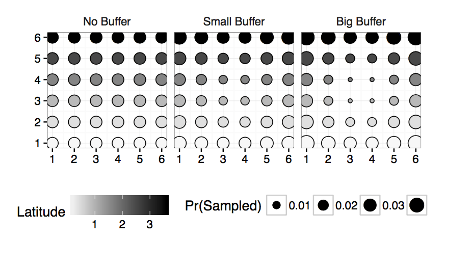
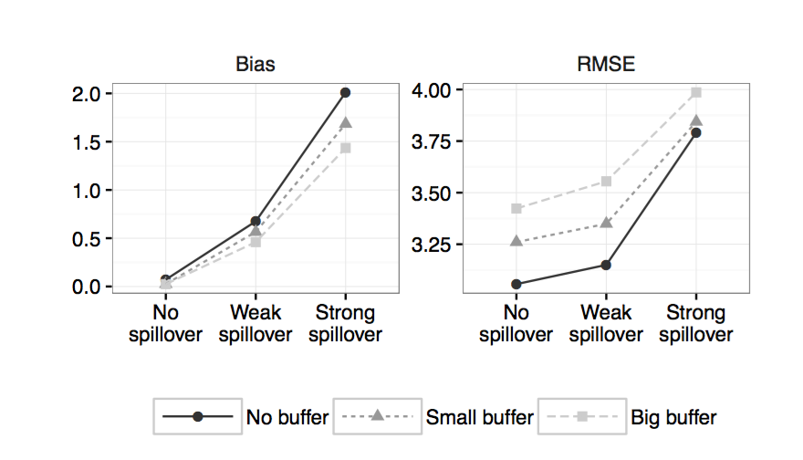
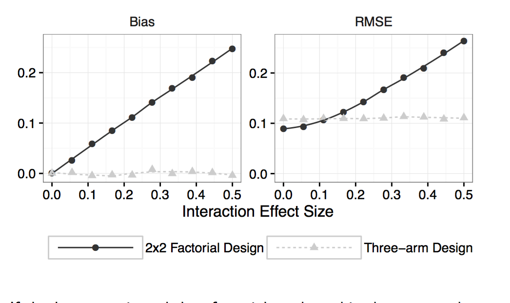

## A Framework for Declaring and Diagnosing Research Designs
By Graeme Blair, Jasper Cooper, \ Alexander Coppock, Macartan Humphreys
```{r, echo=FALSE}
set.seed(343)
suppressMessages({
  library(DeclareDesign)
  library(xtable)
  library(knitr)
  library(sandwich)
  library(lmtest)
  library(ggplot2)
})
pop_draws <- 20
samp_draws <- 20
#source("make_simple_design.R")
```

## What is DAG?
Edges of the graph correspond to causal relations between nodes (variables) $\pi_i ->x_i$. If $X_j$ is in $\pi_i$, then experimental intervention on $X_j$ may affect the distribution of $X_i$, but not reversely.
If $\pi_i$ is fixed by researcher,then $X_i$ will NOT be affected by intervention on $X\( \pi_i or X_i)$

## Conditional Independence in DAGs
A directed acyclic graph (DAG) G whose nodes represent random
variables $X_1, . . . , X_n$ satisfies the independence assumptions:
$X_i$ is independent from $Nondescendents(X_i)|X_\pi$ , for all $1,...,n$
where $X_\pi$ are the parents of $X_i$


## What is DAG?


## Three illustrations: As a DAG


## How can we characterize a research design formally?

Six essential features:
  
* **The population** - Set of units about which inferences are sought and their characteristics;
* **The potential outcomes function** - Outcomes each unit might exhibit depending on how causal process being studied changes the world;
* **The sampling strategy** - Strategy used to select units to include in the study sample;
* **The assignment function** - Manner in which units are assigned to reveal one potential outcome or another;

## How can we characterize a research design formally?
* **The estimands** - Specification of quantities we want to learn about in the world, in terms of potential outcomes;
* **The estimator function** - Procedure for generating estimates of quantities we want to learn about.

## Using Declare Design
Let's install it first:
```{r,eval=FALSE}
#Please install devtools package first
devtools::install_github(repo = "DeclareDesign/DeclareDesign", ref = "ucla-ps-209")
```
If the installation gives you an error, you should install the dependancies it tells you about

## Six "declarations" for each design element

```{r,eval=FALSE}
library(DeclareDesign)

population <- declare_population()
pos        <- declare_potential_outcomes()
sampling   <- declare_sampling()
assignment <- declare_assignment()
estimand   <- declare_estimand()
estimator  <- declare_estimator()

my_design  <- declare_design(population = population,
                             sampling = sampling,
                             potential_outcomes = pos,
                             assignment = assignment,
                             estimator = estimator
)
```


## Declare Design

```{r, echo = FALSE}
population    <- declare_population(
  noise = "rnorm(n_)",
  income_bracket = "sample(1:4, n_, replace = TRUE)",
  size = 5000, 
  super_population = TRUE)
```

```{r, eval = FALSE, echo = TRUE}
population    <- declare_population(
  noise = "rnorm(n_)",
  income_bracket = "sample(1:4, n_, replace = TRUE)",
  size = 5000)
```

The `declare_population` function is extremely flexible and can be used to rapidly generate complex dummy data structures. 

## Step 1: Design

```{r}
potential_outcomes <- declare_potential_outcomes(
  condition_names = c("control", "treatment"),
  formula = 
    Y ~ .1 * (Z == "treatment") + 
    .1 * (Z == "treatment") * income_bracket + 
    noise)
```


Multiple potential outcomes can be defined, e.g. for compliance or attrition.


## Step 1: Design

```{r}
sampling <- declare_sampling(n = 100)
```

Flexible built in options for sampling, though arbitrary user functions can also be employed.

## Step 1: Design

```{r}
assignment <- declare_assignment(
  potential_outcomes  = potential_outcomes, 
  block_variable_name = "income_bracket", 
  block_probabilities = rbind(c(.1, .9),
                              c(.3, .7),
                              c(.7, .3),
                              c(.6, .4)))
```

Flexible built in options for assignment, though arbitrary user functions can also be employed.

## Step 1: Design

```{r}
estimand_ATE <- declare_estimand(
  estimand_text = "mean(Y_Z_treatment - Y_Z_control)",
  potential_outcomes = potential_outcomes)
```

Estimands are functions of potential outcomes stored in superdata.

## Step 1: Design

```{r}
estimator_lsdv <- declare_estimator(
  formula           = Y ~ Z + factor(income_bracket), 
  model             = lm, 
  estimates         = get_regression_coefficient,
  coefficient_name  = "Ztreatment",
  estimand          = estimand_ATE,
  labels            = "LSDV")
```

Estimands are associated with estimators when estimators are declared. 

## Step 1: Design

This set of `R` objects formally characterizes the entire design. 

```{r}
my_design <- declare_design(
  population         = population, 
  potential_outcomes = potential_outcomes, 
  sampling           = sampling, 
  assignment         = assignment, 
  estimator          = estimator_lsdv
)
```

Once done `my_design` is an object that can be posted and shared. It can also be modified, interrogated, and used in many ways.

## Step 1: Design
Our designs may be modifications of existing designs. 

```{r, eval = FALSE}
another_design <- modify_design(my_design,   
   estimator = estimator_robust)
```


## Use the design: Draw Data (Sample and Assign)

Once a design is declared it can be used and interrogated. For example the design has sufficient information to  create mock data. These can be used to confirm design features and simulate  analysis strategies.

```{r}
mock_data <- draw_data(design = my_design)
```

\tiny
```{r, echo = FALSE}
mock_tab <- head(mock_data[, c("Y_Z_control", 
                               "Y_Z_treatment", 
                               "Z","Y","noise", 
                               "income_bracket")])
names(mock_tab) <- c("Y_control", "Y_treat",
                     "Z","Y", "noise", "income_bracket")

kable(mock_tab, digits = 3, row.names = FALSE)
```

## Use the design: Implement Analysis

The design also contains the information needed to implement analysis on either real or simulated data.

\tiny
```{r}
est_tab <- get_estimates(estimator = estimator_lsdv, 
                         data = mock_data)
kable(est_tab, digits = 3, align = 'c')
```

## Use the design: Diagnose

\tiny
```{r}
diagnosis <- diagnose_design(design = my_design, 
                             population_draws = pop_draws, 
                             sample_draws = samp_draws)
kable(summary(diagnosis)[,c("diagnosand_label","diagnosand") , drop = F], digits = 3)
```

## Iteration between steps 1 and 2 to improve the design

```{r}
sampling_larger_sample <- declare_sampling(n = 500)
```

## Iteration between steps 1 and 2 to improve the design
```{r}
my_other_design <- modify_design(
  design   = my_design, 
  sampling = sampling_larger_sample)
diagnosis <- diagnose_design(design = my_other_design, 
                             population_draws = pop_draws, 
                             sample_draws = samp_draws)
```

##Iteration between steps 1 and 2 to improve the design

\tiny
```{r}
kable(summary(diagnosis)[,c("diagnosand_label","diagnosand") , drop = F], digits = 3)
```


## Sampling Decisions: Handling Spatial Spillovers

* **The Challenge** To guard against spillover risks, researchers consider imposing a constraint on their sampling strategy, whereby no two units will ever be sampled if they are deemed too close together. 

* However, sometimes conditional sampling strategies like this assign some units greater weight than others. 

* Researchers can correct for this by using inverse propensity weighting but may worry that this introduces inefficiencies. 

## Sampling Decisions Pseudo Code

```{r, eval = FALSE}
designs <- for(buffer_size in {0,3,4}) declare_design(
  population = declare_population(noise = rnorm,
                                  latitude = 1:6,
                                  size = 36)
  potential_outcomes = declare_potential_outcomes(
    Y ~ Z + spillover + latitude + noise)
  spillover  = declare_interference(
    spillover ~ (distmat %*% Z) < 4) 
  sampling   = declare_assignment(buffer = buffer_size)
  assignment = declare_assignment(m = 1)  
  estimand   = declare_estimand(PATE = 1)
  estimator  = declare_estimator(
    difference_in_means,
    weights = 1/sample_prob)
)
```

## Sampling Decisions: Results 1, Options



## Sampling Decisions: Results 2, Tradeoff



## Assignment Decisions: Factorial Design

- Imagine you're interested in the effects of two treatments, A and B.
- In particular, the effect of A when B=0 and the effect of B when A = 0
- Could do 2x2 factorial design
- Could do 3-arm trial
- What to do?

## Assignment Decisions: Factorial Design: Pseudocode

``` {r, eval = FALSE}
design <- (
population    <-declare_population(
noise = rnorm, size = 500)
potential_outcomes <-  declare_potential_outcomes(
Y ~ .5*Z1 + .5*Z2 + 
int_coef*Z1*Z2 + noise)
assignment_1 <- declare_assignment(``Factorial'')
assignment_2 <- declare_assignment(``Three arm'')
estimand     <- declare_estimand(
mean(Y_Z1_1_Z2_0 - Y_Z1_0_Z2_0)) 
estimator    <- declare_estimator(
Y ~ Z1 + Z2, ``coefficent on Z1'')

```

## Assignment Decisions: Factorial Design, Results




## How to Design and Diagnose Experimental Designs with Baseline Data

## Generating the data to work with
```{r}
set.seed(5)
population_user <- declare_population(
  individuals = list(
    income = declare_variable()),
  villages = list(
    development_level = declare_variable(type = "multinomial", probabilities = 1:3/sum(1:3), outcome_categories = 1:3)
  ), 
  size = c(1000, 200))

user_data <- draw_population(population = population_user)

save(user_data, file = "baseline_data.RData")
```


## 1. Load the data
\tiny
```{r}
load("baseline_data.RData")
kable(head(user_data), digits = 3)
```
## 2. Define the potential outcomes, which will be simulated based on the baseline covariate data
```{r}
potential_outcomes     <-  declare_potential_outcomes(
  condition_names = c("Z0","Z1"),
  formula = Y ~ .01 + .2*(Z=="Z1") + .1*income 
)
```

## 3. Then resample (bootstrap) from user data, respecting levels
```{r}
population <- declare_population(
    individuals = list(
      income = get_variable(level_ID = "individuals_ID", 
                            variable_name = "income",
                            data = user_data)
    ),
    cities = list(
      # Here we just grab a variable that does not vary at city level
      development_level = get_variable(level_ID = "villages_ID",
                                      variable_name = "development_level",
                                      data = user_data)
    ),
    size = c(500, 50),
    options = list(user_data = user_data)
  )
```

## 4. Define one or more analyses we will run based on simulated data. 

This analysis will also be used for power analysis.
```{r}
estimand_ATE <- declare_estimand(estimand_text = "mean(Y_Z_Z1 - Y_Z_Z0)",
                                 potential_outcomes = potential_outcomes)
```

## 5.Declare the design of the experiment.
in this case a simple one without clusters or blocking.
```{r}
assignment <- declare_assignment(potential_outcomes = potential_outcomes)
```

## 6.Declare that we will not sample from the data, but instead analyze it as a population.
```{r}
sampling <- declare_sampling(sampling = FALSE)
```

## 7.Then declare the estimator.
```{r}
estimator <- declare_estimator(formula = Y ~ Z, 
                               estimates = difference_in_means, 
                               estimand = estimand_ATE)
```

## 8.Formally characterize the full design as follows:
```{r}
my_design <- declare_design(population = population, sampling = sampling,
                            assignment = assignment, estimator = estimator, 
                            potential_outcomes = potential_outcomes, label = "simple_design")
```

## Diagnosis
Before finalizing the design,  conduct a power analysis to determine whether 500 units and 10 clusters (villages) are sufficient. To do this, we use the diagnose function.
```{r}
diagnosis <- diagnose_design(design = my_design, 
                             population_draws = 10, 
                             sample_draws = 10)
```


## Diagnosis

\tiny
```{r}
kable(summary(diagnosis) [,c("diagnosand_label","diagnosand"), drop=F], digits = 3)
```

## Mock Analysis
After settling on a sample size and a final design, we can conduct a mock analysis of the data to ensure we are satisfied with the analysis of the data. To do this, we create mock data – simulated from the distributions we set – and then run the analyses on the simulated data.

```{r}
mock_population <- draw_population(population = population)
mock_population <- assign_treatment(
  data = mock_population, 
  assignment = assignment)
mock_population <- draw_outcome(data = 
                                  mock_population, 
                                potential_outcomes = 
                                  potential_outcomes)
kable(get_estimands(estimator = estimator, 
              data = mock_population), digits = 3)
```

## Look at the results
\tiny
```{r}
kable(get_estimates(estimator = estimator, data = mock_population), digits = 3)
```


## Custom Functions
Here a custom population function just selects N random numbers.
```{r}
my_population <- function(size) { data.frame(income = rnorm(size)) }
population <- declare_population(custom_population_function = my_population, 
                                      size = 100)
```

## Custom Functions
This formula and the condition names defined in the declaration place restrictions on the remaining workflow, by setting the outcome name to Y and the names of the conditions. When potential outcomes are constructed in mock data, they will be named in this case Y_Z1 and Y_Z0. When realized outcomes based on a treatment assignment are created, they will be named in this case Y.
```{r}
my_potential_outcomes <- function(data) { (data$Z == "Z1") * 0.25 + 
    runif(nrow(data)) }
potential_outcomes <- declare_potential_outcomes(
  condition_names = c("Z0", "Z1"), 
 potential_outcomes_function = my_potential_outcomes,
  outcome_variable_name = "Y")
```

## Custom Functions
An estimand function takes a data frame with potential outcome columns and returns a scalar.
This one that calculates the difference in means.
```{r}
my_estimand    <- function(data) { mean(data$Y_Z_Z1 - data$Y_Z_Z0) }
estimand       <- declare_estimand(estimand_function = my_estimand, 
                                   potential_outcomes = potential_outcomes)
```

## Custom Functions
An assignment function takes a data frame and returns a vector of treatment assignments
```{r}
my_assignment  <- function(data) { N <- nrow(data); 
sample(c("Z0", "Z1"),
  N, replace = T) }
assignment     <- declare_assignment(
  custom_assignment_function = my_assignment,
  potential_outcomes = potential_outcomes)
```

## Custom Functions
An estimates function takes data and returns a matrix with columns representing estimates and rows representing statistics of the estimates, such as the estimate itself, the standard error, the p-value, etc.

## Custom Functions
```{r}
my_estimates   <- function(data) { 
  est      <- mean(data$Y[data$Z == "Z1"]) -
    mean(data$Y[data$Z == "Z0"])
  se       <- sqrt(var(data$Y[data$Z == "Z1"])/
                     sum(data$Z == "Z1") + var(
                       data$Y[data$Z == "Z0"])/
                     sum(data$Z == "Z0"))
  df       <- nrow(data) - 2
  p        <- 2 * pt(abs(est/se), df = df, lower.tail = FALSE)
  ci_lower <- est - 1.96*se
  ci_upper <- est + 1.96*se
  data.frame(estimate_label = "diff-in-means",
             est = est, se = se, p = p, 
             ci_lower = ci_lower, ci_upper = ci_upper, df = df,
             stringsAsFactors = FALSE)
}
estimator      <- declare_estimator(estimates = my_estimates, 
                                    estimand = estimand)
```

## Custom Functions
Now you can declare the full design, using these six steps.
```{r}
my_design      <- declare_design(population = population,
                                 sampling = sampling, 
                                 potential_outcomes = potential_outcomes,
                                 assignment = assignment, 
                                 estimator = estimator, 
                                 label = "my-design")
```
## Diagnosis
```{r}
diagnosis <- diagnose_design(design = my_design)
kable(summary(diagnosis) [,c("diagnosand_label","diagnosand"), drop=F], digits = 3)
```
